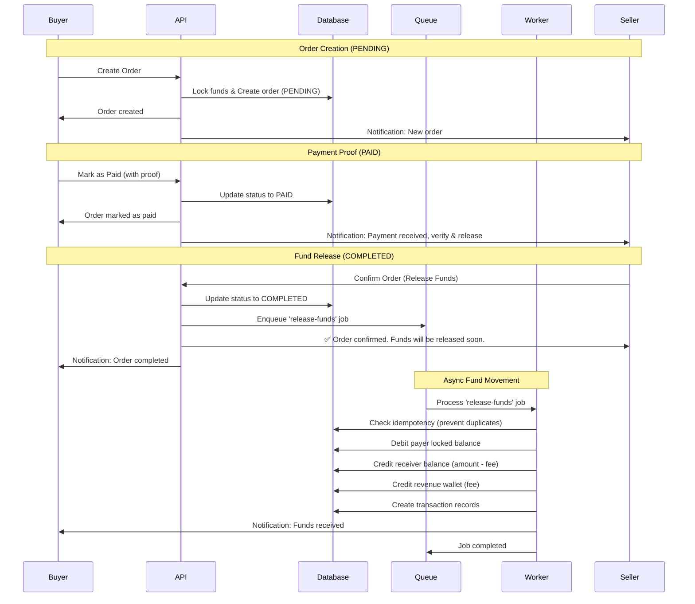

## Flow Explanation

### Phase 1: Order Creation (PENDING)

-   Buyer creates an order
-   Funds are locked (either ad inventory or buyer's wallet)
-   Order status: **PENDING**

### Phase 2: Payment Proof (PAID)

-   Buyer sends proof of payment (e.g., screenshot, transaction ID)
-   Order status: **PAID**
-   Seller is notified to verify and release funds

### Phase 3: Fund Release (COMPLETED)

-   **Synchronous Part** (API):
    -   Seller confirms the order
    -   Order status updated to **COMPLETED**
    -   Job queued for async processing
    -   Immediate response returned to seller
-   **Asynchronous Part** (Worker):
    -   Worker picks up the job
    -   Performs idempotency check
    -   Executes fund transfers
    -   Creates transaction records
    -   Sends notifications

## Key Points

1. **Non-blocking**: API responds immediately after queuing the job
2. **Reliable**: Idempotency ensures funds aren't transferred twice
3. **Transparent**: Users receive notifications at each step
4. **Scalable**: Worker can process multiple fund releases concurrently
