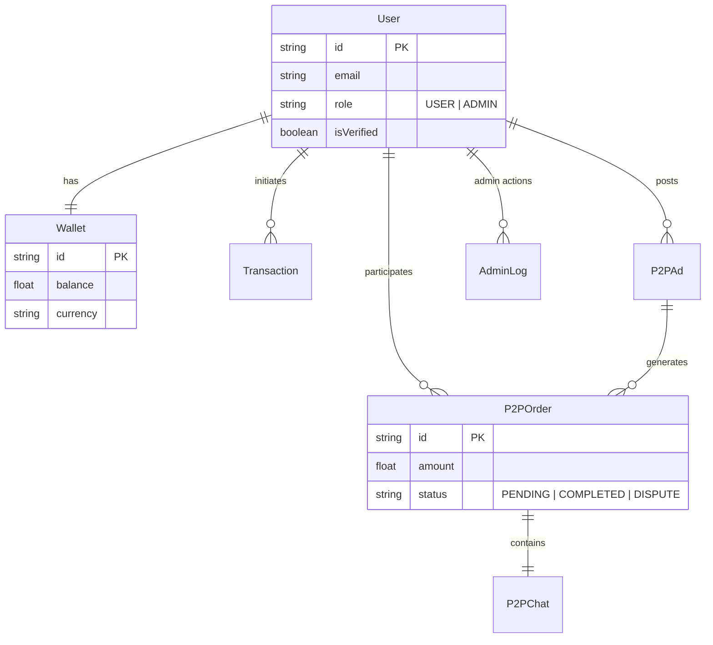

# SwapLink Server


> **A robust, scalable, and secure backend for a cross-border P2P currency exchange platform.**

SwapLink Server is the powerhouse behind the SwapLink Fintech App. Built with **Node.js**, **TypeScript**, and **Prisma**, it orchestrates secure real-time P2P trading, multi-currency wallet management, and automated background reconciliation.

---

## 🚀 Key Features

-   **🔐 Bank-Grade Security**: JWT Authentication, OTP verification (Email/SMS), and Role-Based Access Control (RBAC).
-   **💰 Multi-Currency Wallets**: Virtual account funding, internal transfers, and external bank withdrawals.
-   **🤝 P2P Trading Engine**:
    -   **Escrow System**: Atomic locking of funds during trades to prevent fraud.
    -   **Real-time Chat**: Socket.io powered messaging between buyers and sellers.
    -   **Dispute Resolution**: Admin dashboard for evidence review and forced resolution.
-   **⚡ High-Performance Architecture**:
    -   **BullMQ Workers**: Offloads heavy tasks (Transactions, KYC) to background queues.
    -   **Redis Caching**: Ensures sub-millisecond response times for critical data.
    -   **Socket.io**: Instant updates for order status and chat messages.

---

## 🛠️ Technology Stack

| Category      | Technology                                                                                        | Usage                          |
| :------------ | :------------------------------------------------------------------------------------------------ | :----------------------------- |
| **Runtime**   |           | Server-side JavaScript runtime |
| **Framework** |          | REST API Framework             |
| **Language**  |  | Static Typing & Safety         |
| **Database**  |   | Relational Data Store          |
| **ORM**       |             | Type-safe Database Client      |
| **Queue**     |                           | Background Job Processing      |
| **Caching**   |                  | Caching & Pub/Sub              |
| **Real-time** |    | WebSockets                     |

---

## 🏗️ System Architecture

The system follows a modular **Service-Oriented Architecture** (SOA) within a monolith, ensuring separation of concerns and scalability.

```mermaid
graph TD
    Client[Mobile/Web Client] -->|HTTP/REST| API[API Server (Express)]
    Client -->|WebSocket| Socket[Socket.io Server]

    subgraph "Backend Core"
        API --> Auth[Auth Module]
        API --> Wallet[Wallet Module]
        API --> P2P[P2P Module]

        Auth --> DB[(PostgreSQL)]
        Wallet --> DB
        P2P --> DB

        API -->|Enqueue Jobs| Redis[(Redis Queue)]
    end

    subgraph "Background Workers"
        Worker[BullMQ Workers] -->|Process Jobs| Redis
        Worker -->|Update Status| DB
        Worker -->|External API| Bank[Bank/Crypto APIs]
    end

    Socket -->|Events| API
```

---

## 🗄️ Database Schema (ERD)

A simplified view of the core entities and their relationships.



---

## 🚀 Getting Started

### Prerequisites

-   Node.js v18+
-   PostgreSQL
-   Redis
-   pnpm

### Installation

1.  **Clone the repository**

    ```bash
    git clone https://github.com/codepraycode/swaplink-server.git
    cd swaplink-server
    ```

2.  **Install dependencies**

    ```bash
    pnpm install
    ```

3.  **Configure Environment**

    ```bash
    cp .env.example .env
    # Update .env with your DB credentials and secrets
    ```

4.  **Setup Database**

    ```bash
    pnpm db:migrate
    pnpm db:seed
    ```

5.  **Run the Server**
    ```bash
    # Run API + Worker + DB (Docker)
    pnpm dev:full
    ```

---

## 📚 API Documentation

A comprehensive Postman Collection is available for testing all endpoints.

-   [**Download Postman Collection**](./docs/SwapLink_API.postman_collection.json)
-   [**Admin Module Documentation**](./docs/admin-implementation.md)

### Core Endpoints

| Module     | Method | Endpoint                    | Description         |
| :--------- | :----- | :-------------------------- | :------------------ |
| **Auth**   | `POST` | `/api/v1/auth/register`     | Register new user   |
| **Auth**   | `POST` | `/api/v1/auth/login`        | Login & get JWT     |
| **Wallet** | `POST` | `/api/v1/transfers/process` | Send money          |
| **P2P**    | `GET`  | `/api/v1/p2p/ads`           | Browse Buy/Sell ads |
| **P2P**    | `POST` | `/api/v1/p2p/orders`        | Start a trade       |
| **Admin**  | `GET`  | `/api/v1/admin/disputes`    | Review disputes     |

---

## 🧪 Testing

We use **Jest** for Unit and Integration testing.

> **For detailed instructions on setup, testing, and troubleshooting, please read the [Development Guide](./docs/guides/DEVELOPMENT.md).** > **For Docker usage, check the [Docker Guide](./docs/guides/DOCKER.md).**

```bash
# Run all tests
pnpm test

# Run specific test file
pnpm test src/modules/auth/__tests__/auth.service.test.ts
```

---

## 📄 License

This project is proprietary and confidential. Unauthorized copying or distribution is strictly prohibited.
