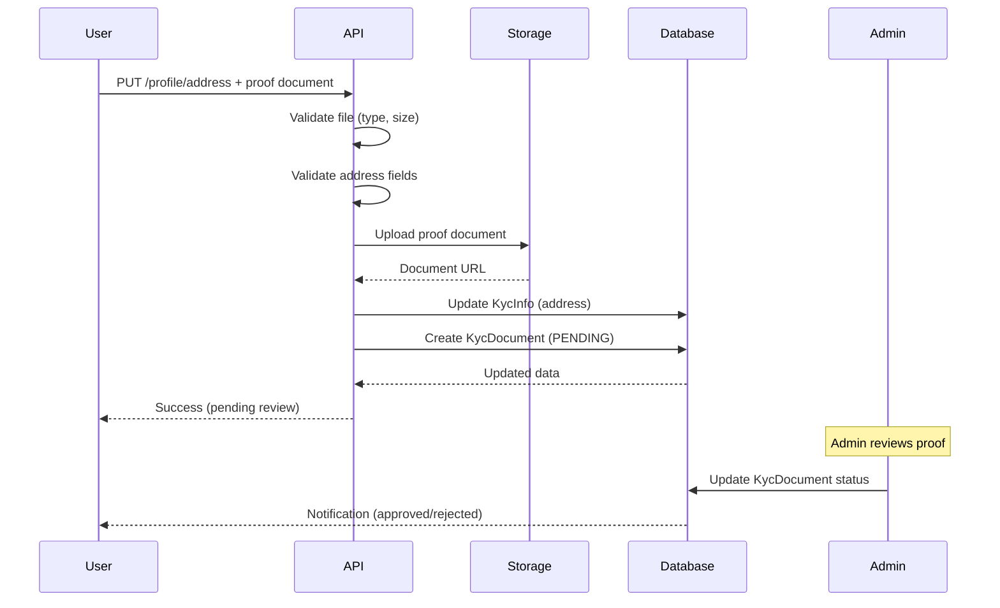

# Profile Update Restrictions & Address Update Flow

## Overview

The profile update system has been enhanced with security restrictions to prevent unauthorized name changes and ensure proper verification of address updates through proof of address documents.

---

## 🚫 Restrictions

### 1. **Name Changes Blocked**

- Users **cannot** update `firstName` or `lastName` through the API
- Any attempt to change names will result in an error
- **Reason**: Prevent identity fraud and ensure KYC compliance

**Error Response:**

```json
{
    "success": false,
    "message": "Name changes are not allowed. Please contact support if you need to update your name."
}
```

### 2. **Address Updates Require Proof**

- Address changes **must** include proof of address document
- Accepted documents: Utility bill or bank statement
- Document must show the user's name and new address
- **Reason**: Comply with KYC/AML regulations

---

## 📍 Address Update Endpoint

### **PUT** `/api/v1/user/profile/address`

**Authentication:** Required (Bearer token)

**Content-Type:** `multipart/form-data`

### Request Parameters

| Field            | Type   | Required     | Description                                             |
| ---------------- | ------ | ------------ | ------------------------------------------------------- |
| `address`        | string | Optional\*   | Street address                                          |
| `city`           | string | Optional\*   | City                                                    |
| `state`          | string | Optional\*   | State/Province                                          |
| `country`        | string | Optional\*   | Country                                                 |
| `postalCode`     | string | Optional\*   | Postal/ZIP code                                         |
| `proofOfAddress` | file   | **Required** | Utility bill or bank statement (JPG, PNG, PDF, max 5MB) |

\*At least one address field must be provided

---

## 📤 Request Examples

### cURL Example

```bash
curl -X PUT http://localhost:3000/api/v1/user/profile/address \
  -H "Authorization: Bearer YOUR_TOKEN" \
  -F "address=123 Main Street" \
  -F "city=Lagos" \
  -F "state=Lagos" \
  -F "country=Nigeria" \
  -F "postalCode=100001" \
  -F "proofOfAddress=@/path/to/utility-bill.pdf"
```

### JavaScript (FormData) Example

```javascript
const formData = new FormData();
formData.append('address', '123 Main Street');
formData.append('city', 'Lagos');
formData.append('state', 'Lagos');
formData.append('country', 'Nigeria');
formData.append('postalCode', '100001');
formData.append('proofOfAddress', fileInput.files[0]); // File from input

const response = await fetch('/api/v1/user/profile/address', {
    method: 'PUT',
    headers: {
        Authorization: `Bearer ${token}`,
    },
    body: formData,
});
```

### React Native Example

```javascript
const formData = new FormData();
formData.append('address', '123 Main Street');
formData.append('city', 'Lagos');
formData.append('state', 'Lagos');
formData.append('country', 'Nigeria');
formData.append('postalCode', '100001');
formData.append('proofOfAddress', {
    uri: documentUri,
    type: 'application/pdf',
    name: 'utility-bill.pdf',
});

const response = await fetch('/api/v1/user/profile/address', {
    method: 'PUT',
    headers: {
        Authorization: `Bearer ${token}`,
        'Content-Type': 'multipart/form-data',
    },
    body: formData,
});
```

---

## ✅ Success Response

**Status:** `200 OK`

```json
{
    "success": true,
    "message": "Address updated successfully. Your proof of address is pending review.",
    "data": {
        "user": {
            "id": "user-uuid",
            "email": "user@example.com",
            "firstName": "John",
            "lastName": "Doe",
            "kycInfo": {
                "id": "kyc-uuid",
                "userId": "user-uuid",
                "address": "123 Main Street",
                "city": "Lagos",
                "state": "Lagos",
                "country": "Nigeria",
                "postalCode": "100001"
            }
        },
        "kycInfo": {
            "id": "kyc-uuid",
            "userId": "user-uuid",
            "address": "123 Main Street",
            "city": "Lagos",
            "state": "Lagos",
            "country": "Nigeria",
            "postalCode": "100001"
        }
    }
}
```

---

## ❌ Error Responses

### Missing Proof of Address

**Status:** `400 Bad Request`

```json
{
    "success": false,
    "message": "Proof of address document is required (utility bill or bank statement showing name and new address)"
}
```

### No Address Fields Provided

**Status:** `400 Bad Request`

```json
{
    "success": false,
    "message": "At least one address field must be provided"
}
```

### Invalid File Type

**Status:** `400 Bad Request`

```json
{
    "success": false,
    "message": "Invalid file type: image/gif. Allowed: jpeg, png, jpg, pdf"
}
```

### File Too Large

**Status:** `400 Bad Request`

```json
{
    "success": false,
    "message": "File is too large. Please upload a smaller file."
}
```

---

## 🔄 Update Flow



---

## 📋 Proof of Address Document Requirements

### Accepted Document Types

1. **Utility Bill** (Electricity, Water, Gas, Internet)
2. **Bank Statement**
3. **Government-issued documents** with address

### Document Must Show

- ✅ User's full name (matching KYC records)
- ✅ Complete address (matching submitted data)
- ✅ Issue date (within last 3 months recommended)
- ✅ Clear and legible text

### File Requirements

- **Formats:** JPG, PNG, PDF
- **Max Size:** 5MB
- **Quality:** High resolution, readable text

---

## 🔐 Security & Compliance

### Why These Restrictions?

1. **Name Change Prevention**
    - Prevents identity fraud
    - Ensures KYC data integrity
    - Complies with financial regulations
    - Name changes require manual verification

2. **Proof of Address Requirement**
    - Verifies user's actual residence
    - Prevents address fraud
    - Meets KYC/AML compliance standards
    - Creates audit trail

### Audit Logging

All address updates are logged with:

- User ID
- Timestamp
- Old and new address data
- Proof of address document URL
- IP address (if available)

---

## 🗄️ Database Changes

### KycInfo Table

Address fields are stored in the `KycInfo` table:

```prisma
model KycInfo {
  id          String   @id @default(uuid())
  userId      String   @unique

  // Address fields
  address     String?
  city        String?
  state       String?
  country     String?
  postalCode  String?

  // ... other fields
}
```

### KycDocument Table

Proof of address is stored as a document:

```prisma
model KycDocument {
  id              String            @id @default(uuid())
  kycInfoId       String

  documentType    String            // "PROOF_OF_ADDRESS"
  documentUrl     String            // S3/Cloudinary URL
  status          KycDocumentStatus // PENDING, APPROVED, REJECTED
  rejectionReason String?
  verifiedAt      DateTime?

  createdAt       DateTime          @default(now())
  updatedAt       DateTime          @updatedAt
}
```

---

## 👨‍💼 Admin Review Process

### Document Status Flow

1. **PENDING** - Initial upload, awaiting review
2. **APPROVED** - Document verified, address confirmed
3. **REJECTED** - Document invalid or doesn't match

### Admin Actions

Admins can review proof of address documents through the admin panel:

- View uploaded document
- Verify name and address match
- Approve or reject with reason
- Notify user of decision

---

## 🧪 Testing

### Test Cases

**1. Update Address with Valid Proof**

```bash
# Should succeed
curl -X PUT /api/v1/user/profile/address \
  -H "Authorization: Bearer TOKEN" \
  -F "address=123 Main St" \
  -F "city=Lagos" \
  -F "proofOfAddress=@utility-bill.pdf"
```

**2. Update Address without Proof**

```bash
# Should fail with 400
curl -X PUT /api/v1/user/profile/address \
  -H "Authorization: Bearer TOKEN" \
  -H "Content-Type: application/json" \
  -d '{"address": "123 Main St", "city": "Lagos"}'
```

**3. Attempt Name Change**

```bash
# Should fail with 400
curl -X PUT /api/v1/user/profile \
  -H "Authorization: Bearer TOKEN" \
  -H "Content-Type: application/json" \
  -d '{"firstName": "NewName"}'
```

**4. Update Only City**

```bash
# Should succeed (partial address update)
curl -X PUT /api/v1/user/profile/address \
  -H "Authorization: Bearer TOKEN" \
  -F "city=Abuja" \
  -F "proofOfAddress=@utility-bill.pdf"
```

**5. Invalid File Type**

```bash
# Should fail with 400
curl -X PUT /api/v1/user/profile/address \
  -H "Authorization: Bearer TOKEN" \
  -F "address=123 Main St" \
  -F "proofOfAddress=@document.txt"
```

---

## 📱 Mobile Integration

### React Native Form Example

```jsx
import DocumentPicker from 'react-native-document-picker';

const UpdateAddressForm = () => {
    const [address, setAddress] = useState('');
    const [city, setCity] = useState('');
    const [document, setDocument] = useState(null);

    const pickDocument = async () => {
        try {
            const result = await DocumentPicker.pick({
                type: [DocumentPicker.types.pdf, DocumentPicker.types.images],
            });
            setDocument(result[0]);
        } catch (err) {
            if (DocumentPicker.isCancel(err)) {
                // User cancelled
            } else {
                throw err;
            }
        }
    };

    const updateAddress = async () => {
        if (!document) {
            Alert.alert('Error', 'Please upload proof of address');
            return;
        }

        const formData = new FormData();
        formData.append('address', address);
        formData.append('city', city);
        formData.append('proofOfAddress', {
            uri: document.uri,
            type: document.type,
            name: document.name,
        });

        try {
            const response = await fetch('/api/v1/user/profile/address', {
                method: 'PUT',
                headers: {
                    Authorization: `Bearer ${token}`,
                },
                body: formData,
            });

            const data = await response.json();

            if (data.success) {
                Alert.alert('Success', data.message);
            } else {
                Alert.alert('Error', data.message);
            }
        } catch (error) {
            Alert.alert('Error', 'Failed to update address');
        }
    };

    return (
        <View>
            <TextInput placeholder="Address" value={address} onChangeText={setAddress} />
            <TextInput placeholder="City" value={city} onChangeText={setCity} />
            <Button title="Upload Proof" onPress={pickDocument} />
            {document && <Text>Selected: {document.name}</Text>}
            <Button title="Update Address" onPress={updateAddress} />
        </View>
    );
};
```

---

## 🔄 Migration Notes

### Existing Users

- Existing users with addresses in their profile can continue using them
- New address updates require proof of address
- No retroactive proof required for existing addresses

### Backward Compatibility

- Old `PUT /profile` endpoint still works but blocks name and address changes
- New `PUT /profile/address` endpoint required for address updates
- Avatar updates unchanged (`POST /profile/avatar`)

---

## 📞 Support Process

### Name Change Requests

Users who need to change their name must:

1. Contact support via email/chat
2. Provide legal documentation (marriage certificate, deed poll, etc.)
3. Wait for manual verification
4. Support team updates name after verification

### Address Update Issues

If proof of address is rejected:

1. User receives notification with rejection reason
2. User can re-upload corrected document
3. Admin re-reviews the new document

---

## 🎯 Best Practices

### For Frontend Developers

1. **Clear Instructions**: Show users what documents are acceptable
2. **File Validation**: Validate file type and size before upload
3. **Progress Indicators**: Show upload progress for large files
4. **Error Handling**: Display clear error messages
5. **Status Tracking**: Show document review status to users

### For Backend Developers

1. **Audit Logging**: Always log address changes
2. **Document Storage**: Use secure cloud storage (S3, Cloudinary)
3. **File Cleanup**: Implement cleanup for rejected documents
4. **Rate Limiting**: Prevent abuse of upload endpoint
5. **Notifications**: Notify users of review outcomes

---

## 📊 Monitoring & Analytics

### Metrics to Track

- Address update requests per day
- Document approval/rejection rates
- Average review time
- Common rejection reasons
- File upload failures

### Alerts

- High rejection rate (> 30%)
- Slow review times (> 48 hours)
- Upload failures (> 5%)
- Suspicious patterns (multiple updates from same user)

---

## 🔮 Future Enhancements

- [ ] Automated document verification (OCR)
- [ ] Real-time address validation APIs
- [ ] Support for more document types
- [ ] Multi-language document support
- [ ] Blockchain-based proof of address
- [ ] Integration with government databases
