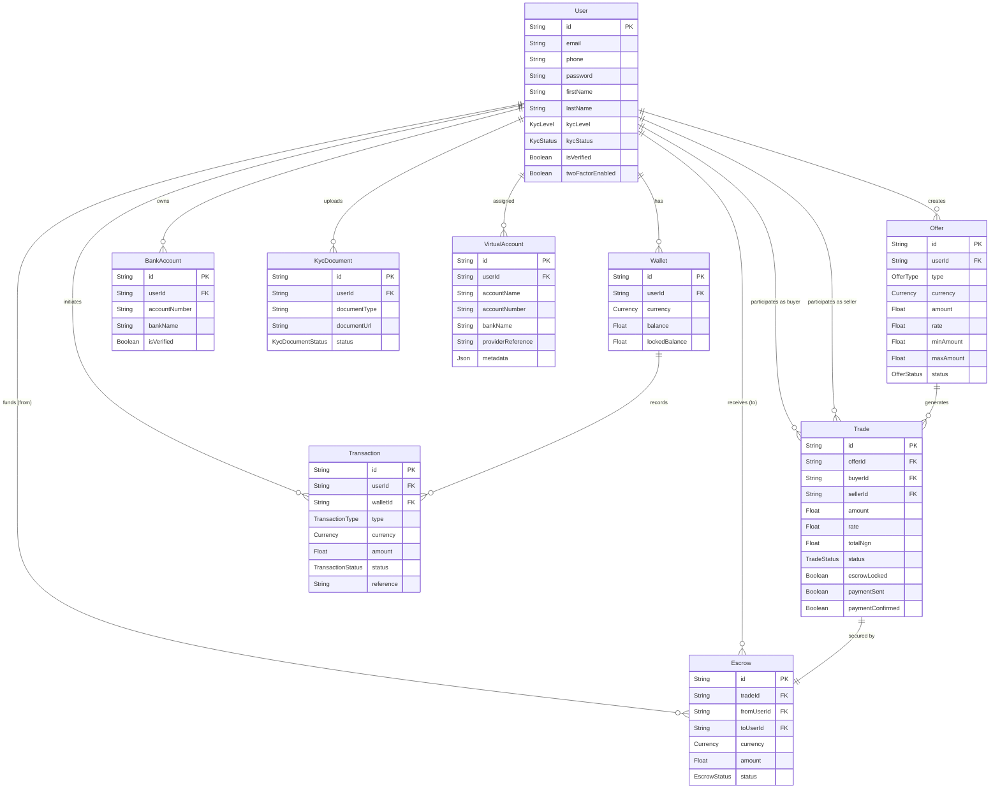

# Entity Relation Model (ERM) - SwapLink

This document visualizes the data relationships for the SwapLink application based on the current Prisma schema.

## Visual Diagram

## Key Relationships Explained

1.  **User & Wallet**: One-to-Many. A user can have multiple wallets (e.g., one for USD, one for NGN).
2.  **User & Offer**: One-to-Many. A user can post multiple buy or sell offers.
3.  **Offer & Trade**: One-to-Many. A single offer (e.g., "Selling $1000") can be partially fulfilled by multiple trades (e.g., Trade 1: $200, Trade 2: $800).
4.  **Trade & Escrow**: One-to-One. Every active trade MUST have a corresponding escrow record to lock the funds and ensure safety.
5.  **User & Trade**: A user can be either the `buyer` or the `seller` in a trade.
6.  **Transaction**: An immutable ledger record for every balance change in a Wallet (Deposit, Withdrawal, Trade Lock, Trade Release).
