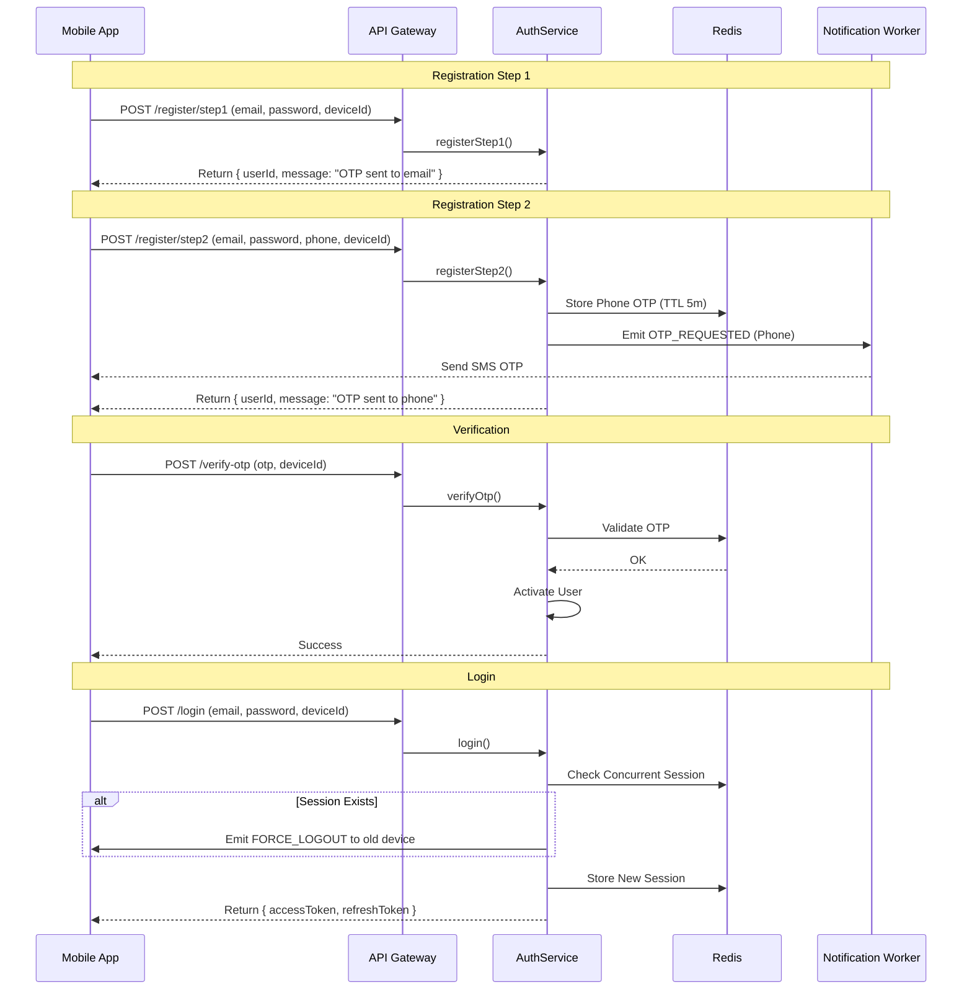
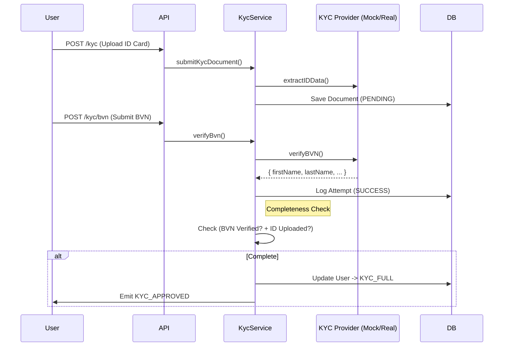

# Identity & Security Module

## Overview

The Identity & Security Module is the gatekeeper of the SwapLink platform. It manages user authentication, session security, KYC (Know Your Customer) compliance, and sensitive operations like PIN management.

## Architecture

### System Components

-   **AuthService**: Core logic for registration, login, and token management.
-   **KycService**: Handles multi-tier verification (BVN, Documents) and status upgrades.
-   **OtpService**: Generates secure 6-digit codes and emits `OTP_REQUESTED` events.
-   **AuthListener**: Async event handler for sending emails/SMS via background workers.
-   **Redis**: Stores active sessions (`session:{userId}`) and OTPs (`otp:{type}:{id}`).

### Data Models

Key entities in the database (Prisma):

-   **User**: Core identity. Tracks `kycLevel` (NONE, BASIC, FULL), `kycStatus`, and `deviceId`.
-   **KycInfo**: Stores detailed user info (DOB, Address, Biometrics, IDs). Linked to User (1:1).
-   **KycDocument**: Stores URLs of uploaded IDs/Passports. Linked to KycInfo.
-   **KycAttempt**: Logs every BVN/NIN verification attempt (Success/Failure) for audit.
-   **Otp**: Ephemeral storage for OTP codes (backed by Redis in practice).

---

## Workflows (Diagrams)

### 1. Registration & Login Flow



### 2. KYC Verification Flow



---

## API Reference

### 1. Authentication

#### `POST /auth/register/step1`

Initiates registration. Sends an OTP to the provided email.

-   **Body**:
    ```json
    {
        "firstName": "John",
        "lastName": "Doe",
        "email": "john@example.com",
        "password": "SecurePassword123!",
        "deviceId": "uuid-v4-device-id"
    }
    ```
-   **Response (201)**:
    ```json
    {
        "success": true,
        "data": { "userId": "uuid...", "message": "Step 1 successful. OTP sent to email." }
    }
    ```

#### `POST /auth/register/step2`

Completes registration profile. Verifies password, adds phone number, and sends phone OTP.

-   **Body**:
    ```json
    {
        "email": "john@example.com",
        "password": "SecurePassword123!",
        "phone": "+2348012345678",
        "deviceId": "uuid-v4-device-id"
    }
    ```
-   **Response (200)**:
    ```json
    {
        "success": true,
        "data": { "userId": "uuid...", "message": "Step 2 successful. OTP sent to phone." }
    }
    ```

#### `POST /auth/verify-otp`

Verifies email or phone OTP. Activates account (`isVerified=true`) and upgrades `kycLevel` to `BASIC` if both email and phone are verified.

-   **Body**:
    ```json
    {
        "identifier": "john@example.com",
        "otp": "123456",
        "purpose": "EMAIL_VERIFICATION", // or PHONE_VERIFICATION, PASSWORD_RESET
        "deviceId": "uuid-v4-device-id"
    }
    ```

#### `POST /auth/login`

Authenticates user and issues tokens. Invalidates previous sessions.

-   **Body**:
    ```json
    {
        "email": "john@example.com",
        "password": "SecurePassword123!",
        "deviceId": "uuid-v4-device-id"
    }
    ```
-   **Response (200)**:
    ```json
    {
        "success": true,
        "data": {
            "user": { "id": "...", "email": "...", "kycLevel": "NONE" },
            "tokens": { "accessToken": "...", "refreshToken": "..." }
        }
    }
    ```

#### `POST /auth/refresh-token`

Refreshes the access token using a valid refresh token.

-   **Body**:
    ```json
    {
        "refreshToken": "eyJhbGciOiJIUzI1NiIsInR5cCI6IkpXVCJ9..."
    }
    ```
-   **Response (200)**:
    ```json
    {
        "success": true,
        "data": {
            "tokens": {
                "accessToken": "...",
                "refreshToken": "...",
                "expiresIn": 86400
            }
        }
    }
    ```

### 2. KYC

#### `POST /auth/kyc` (Multipart)

Uploads an identity document (Tier 1 Requirement).

-   **Headers**: `Content-Type: multipart/form-data`
-   **Body**:
    -   `document`: (File)
    -   `documentType`: `ID_CARD` | `PASSPORT` | `NIN`

#### `POST /auth/kyc/info`

Submits personal information (DOB, Address, BVN, NIN).

-   **Body**:
    ```json
    {
        "address": "123 Main St",
        "city": "Lagos",
        "state": "Lagos",
        "country": "NG",
        "postalCode": "100001",
        "dob": "1990-01-01",
        "bvn": "12345678901"
    }
    ```

#### `POST /auth/kyc/biometrics` (Multipart)

Uploads selfie and liveness video.

-   **Headers**: `Content-Type: multipart/form-data`
-   **Body**:
    -   `selfie`: (Image File)
    -   `video`: (Video File)

#### `POST /auth/kyc/bvn`

Verifies BVN (Tier 2 Requirement). Triggers upgrade if ID is also present.

-   **Body**:
    ```json
    { "bvn": "12345678901" }
    ```

---

## Frontend Integration Checklist

For a seamless integration, ensure your frontend application handles the following:

-   [ ] **Device ID Generation**: Generate a UUID v4 on first app launch and store it securely (`SecureStore`). Send it as `x-device-id` header on **every** request.
-   [ ] **Socket Connection**: Connect to the Socket.IO server using the user's JWT. Listen for `FORCE_LOGOUT` and `KYC_APPROVED` events.
-   [ ] **Global Error Handling**:
    -   **401 Unauthorized**: Token expired or invalid. Attempt refresh or redirect to login.
    -   **403 Forbidden**: Account suspended or KYC level insufficient.
    -   **429 Too Many Requests**: Rate limit hit (display a "Try again later" toast).
-   [ ] **Token Storage**: Store `accessToken` and `refreshToken` in secure storage (Keychain/Keystore), **never** in local storage or async storage.
-   [ ] **KYC State Management**: The user object contains `kycLevel` and `kycStatus`. Use these to conditionally render UI (e.g., lock "Send Money" if level is NONE).

## Error Codes

| Status | Code                | Description                      | Action                 |
| :----- | :------------------ | :------------------------------- | :--------------------- |
| 400    | `BAD_REQUEST`       | Invalid input or missing fields. | Check form validation. |
| 401    | `UNAUTHORIZED`      | Invalid credentials or token.    | Redirect to login.     |
| 403    | `FORBIDDEN`         | Account inactive or restricted.  | Contact support.       |
| 404    | `NOT_FOUND`         | User or resource not found.      | -                      |
| 409    | `CONFLICT`          | Email/Phone already exists.      | Ask user to login.     |
| 429    | `TOO_MANY_REQUESTS` | Rate limit exceeded.             | Wait and retry.        |
