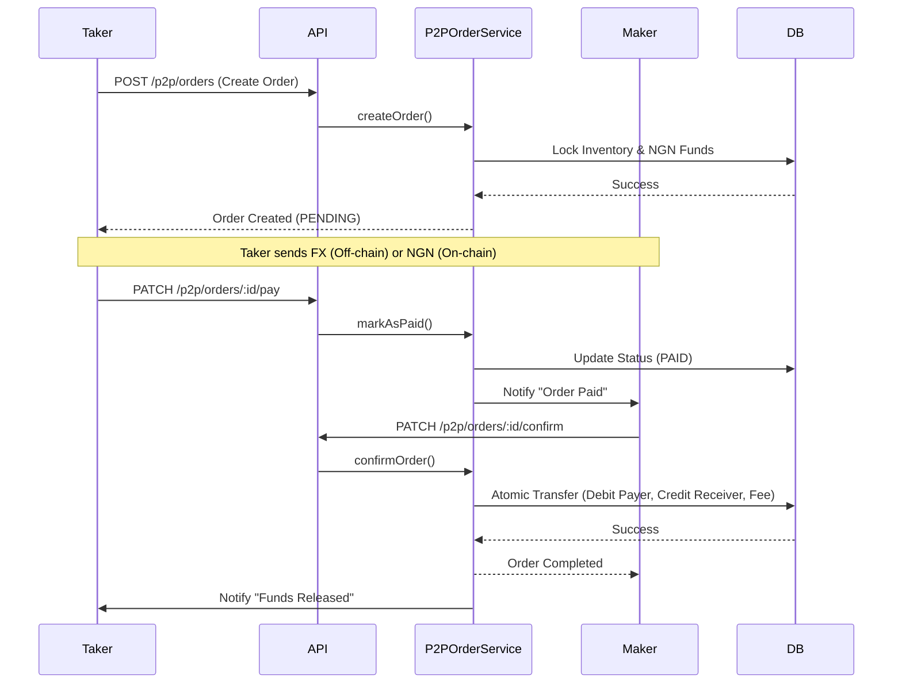

# P2P Trading Module

## Overview

The P2P (Peer-to-Peer) Trading Module enables users to exchange foreign currency (FX) for Nigerian Naira (NGN) securely. It acts as an escrow service where the NGN leg of the transaction is handled on-chain (SwapLink Wallet), while the FX leg is handled off-chain (External Bank Transfer).

## Architecture

### System Components

-   **P2PAdService**: Manages buy/sell advertisements with optimistic locking for inventory management.
-   **P2POrderService**: Handles the order lifecycle (Creation, Payment, Release) and atomic financial settlements.
-   **P2PChatService**: Provides real-time messaging between Maker and Taker using Socket.IO.
-   **P2PDisputeService**: Manages conflict resolution, allowing users to freeze orders and admins to intervene.
-   **P2PFeeService**: Calculates transaction fees (1% split between Maker and Taker).
-   **ServiceRevenueService**: Centralized management of the system's revenue wallet.

### Data Models

-   **P2PAd**: An advertisement to Buy or Sell FX. Contains price, limits, and inventory (`remainingAmount`).
-   **P2POrder**: A trade instance between a Maker and a Taker. Tracks status (`PENDING`, `PAID`, `COMPLETED`, `DISPUTE`, `CANCELLED`).
-   **P2PChat**: Messages exchanged within an order context.
-   **P2PPaymentMethod**: User's external bank details for receiving FX.

---

## Workflows

### 1. Order Lifecycle (Happy Path)

The standard flow for a successful trade.



---

## API Reference & Postman Testing

### Prerequisites

-   **Base URL**: `http://localhost:3000/api/v1`
-   **Auth**: Bearer Token required.

### 1. Payment Methods

Manage external bank accounts for receiving FX.

-   **Create**: `POST {{baseUrl}}/p2p/payment-methods`
    ```json
    {
        "currency": "USD",
        "bankName": "Chase Bank",
        "accountNumber": "1234567890",
        "accountName": "John Doe",
        "details": { "routingNumber": "021..." }
    }
    ```
-   **List**: `GET {{baseUrl}}/p2p/payment-methods`

### 2. Ads

Create and manage advertisements.

-   **Create Ad**: `POST {{baseUrl}}/p2p/ads`
    ```json
    {
        "type": "BUY_FX", // Maker wants to BUY FX (Pays NGN)
        "currency": "USD",
        "totalAmount": 1000,
        "price": 1500, // NGN per USD
        "minLimit": 100,
        "maxLimit": 1000,
        "paymentMethodId": "uuid..." // Required for BUY_FX
    }
    ```
-   **List Ads**: `GET {{baseUrl}}/p2p/ads?currency=USD&type=BUY_FX`

### 3. Orders

Execute trades.

-   **Create Order**: `POST {{baseUrl}}/p2p/orders`
    ```json
    {
        "adId": "uuid...",
        "amount": 100 // Amount of FX to trade
    }
    ```
-   **Get Order**: `GET {{baseUrl}}/p2p/orders/:id`
-   **Mark Paid**: `PATCH {{baseUrl}}/p2p/orders/:id/pay`
    -   _Note_: Taker calls this after sending funds off-chain.
-   **Confirm (Release Funds)**: `PATCH {{baseUrl}}/p2p/orders/:id/confirm`
    -   _Note_: Only the Maker can release funds.
-   **Cancel Order**: `PATCH {{baseUrl}}/p2p/orders/:id/cancel`

### 4. Chat

Manage chat attachments and history.

-   **Upload Image**: `POST {{baseUrl}}/p2p/chat/upload` (Multipart)
    -   Body: `image` (File)
-   **Get History**: `GET {{baseUrl}}/p2p/chat/:orderId/messages`

---

## Mobile App Integration (Expo)

### 1. Real-time Chat

The chat system uses Socket.IO. Connect to the socket server and listen for message events.

```typescript
// Join Order Room (Optional, or just listen to user events)
// Currently, messages are emitted to specific User IDs.

socket.on('NEW_MESSAGE', (message: P2PChatMessage) => {
    if (message.orderId === currentOrderId) {
        setMessages(prev => [...prev, message]);
    } else {
        showNotification(`New message from ${message.senderName}`);
    }
});
```

### 2. Order Status Updates

Listen for notifications to update the UI when an order status changes (e.g., Maker releases funds).

```typescript
socket.on('NOTIFICATION_NEW', notification => {
    if (notification.type === 'TRANSACTION' && notification.data.orderId) {
        // Refresh Order Details
        fetchOrder(notification.data.orderId);
    }
});
```

### 3. Fee Display

Always display the fee breakdown to the user **before** they confirm an order.

-   **Formula**: `Total Fee = Amount * 0.01` (1%).
-   **Split**: Maker pays 0.5%, Taker pays 0.5%.
-   **UI**: "Service Fee: 0.5%" (Deducted from the final amount received).

---

## Testing Guide

1.  **Verification Script**: Run `npx ts-node src/scripts/verify-p2p-flow.ts` to simulate a full trade cycle.
2.  **Manual Flow**:
    -   **User A (Maker)**: Create a `BUY_FX` Ad.
    -   **User B (Taker)**: Create an Order on that Ad.
    -   **User B**: Mark as Paid.
    -   **User A**: Release Funds.
    -   **Verify**: Check User A's Wallet (Debited NGN), User B's Wallet (Credited NGN - Fee), and Revenue Wallet (Credited Fee).
