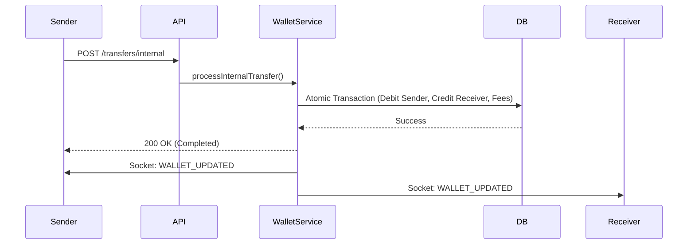
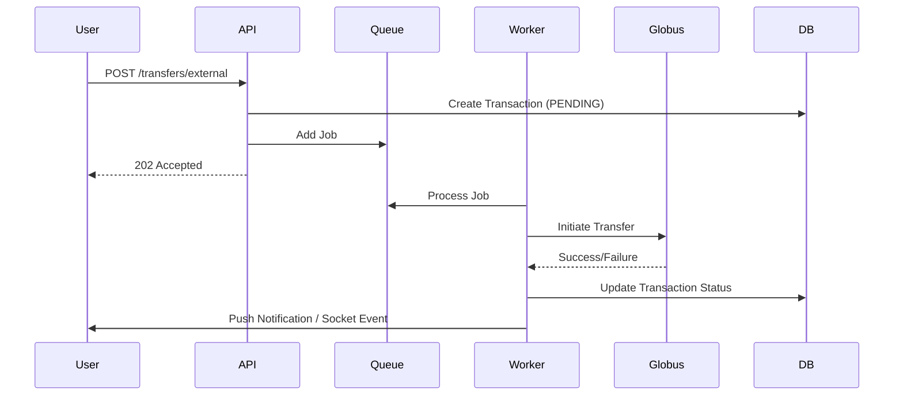

# Wallet & Core Banking Module

## Overview

The Wallet & Core Banking Module is the financial heart of SwapLink. It manages user wallets (NGN), handles money movement (Internal & External transfers), integrates with banking providers (Globus Bank), and ensures financial integrity through atomic transactions and reconciliation.

## Architecture

### System Components

-   **WalletService**: Core logic for balance management, transfers, and atomic ledger entries.
-   **GlobusService**: Integration layer for Globus Bank API (Account creation, Transfers, Requery).
-   **TransferWorker**: Background worker for processing asynchronous external transfers.
-   **ReconciliationJob**: Cron jobs for detecting and resolving stuck transactions and daily discrepancies.
-   **WebhookService**: Handles inbound notifications from banking providers (e.g., Deposits).

### Data Models

-   **Wallet**: Stores user balance (Decimal precision). 1:1 with User.
-   **VirtualAccount**: Dedicated NUBAN for receiving funds. Linked to Wallet.
-   **Transaction**: Immutable record of all money movement. Types: `DEPOSIT`, `TRANSFER`, `WITHDRAWAL`, `FEE`, `REVERSAL`.
-   **Beneficiary**: Saved recipients for quick transfers.

---

## Workflows

### 1. Internal Transfer (P2P)

Internal transfers are **synchronous** and **atomic**. Money moves instantly between two SwapLink users.



### 2. External Transfer (Outbound)

External transfers are **asynchronous**. The request is queued and processed by a worker.



---

## API Reference & Postman Testing

### Prerequisites

-   **Base URL**: `http://localhost:3000/api/v1`
-   **Auth**: Bearer Token required.

### 1. Get Wallet Balance

Retrieve current balance and virtual account details.

-   **Method**: `GET`
-   **URL**: `{{baseUrl}}/wallet`
-   **Response**:
    ```json
    {
        "balance": 50000.0,
        "currency": "NGN",
        "virtualAccount": {
            "accountNumber": "1100000000",
            "bankName": "Globus Bank"
        }
    }
    ```

### 2. Name Enquiry

Resolve an account number before transfer.

-   **Method**: `GET`
-   **URL**: `{{baseUrl}}/wallet/name-enquiry?accountNumber=1234567890&bankCode=000`
-   **Response**:
    ```json
    {
        "accountName": "JOHN DOE",
        "accountNumber": "1234567890",
        "bankCode": "000",
        "isInternal": false
    }
    ```

### 3. Initiate Transfer

Send money to an internal or external account.

-   **Method**: `POST`
-   **URL**: `{{baseUrl}}/wallet/transfer`
-   **Body**:
    ```json
    {
        "amount": 5000,
        "accountNumber": "1234567890",
        "bankCode": "000", // Use "000" for internal if applicable, or real bank code
        "narration": "Payment for services",
        "pin": "1234" // Transaction PIN
    }
    ```

### 4. Webhook (Simulation)

Simulate an inbound deposit from Globus Bank.

-   **Method**: `POST`
-   **URL**: `{{baseUrl}}/webhooks/globus/inflow`
-   **Headers**: `x-globus-signature: <calculated_signature>` (See WebhookService for logic)
-   **Body**:
    ```json
    {
        "accountNumber": "1100000000", // User's Virtual Account
        "amount": 10000,
        "reference": "REF-12345",
        "originatorName": "Sender Name",
        "originatorAccount": "0000000000",
        "originatorBank": "Access Bank"
    }
    ```

---

## Mobile App Integration (Expo)

### 1. Real-time Balance Updates

The wallet balance changes frequently. Instead of polling, listen for the `WALLET_UPDATED` socket event.

```typescript
// Socket Listener
socket.on('WALLET_UPDATED', data => {
    console.log('New Balance:', data.balance);
    // Update Redux/Zustand store
    updateWalletStore(data);

    // Show Toast
    if (data.message) {
        Toast.show(data.message);
    }
});
```

### 2. Transaction History

Fetch transactions with pagination.

-   **Endpoint**: `GET /api/v1/wallet/transactions?page=1&limit=20`
-   **Display**: Group by date (Today, Yesterday, etc.). Show `type` (Credit/Debit) and `status` (Pending/Success/Failed).

### 3. PIN Management

Transactions require a 4-digit PIN.

-   **Setup**: `POST /api/v1/account/pin/set` (First time)
-   **Verify**: Prompt user for PIN before calling the transfer endpoint.

### 4. Handling Deep Links

-   **Inbound**: When a user receives money, the push notification should deep link to the **Transaction Details** screen.
    -   Scheme: `swaplink://transaction/:id`

---

## Testing Guide

1.  **Unit Tests**: Run `npm run test:unit` to verify `WalletService` logic (fees, atomic transactions).
2.  **Integration Tests**: Run `npm run test:integration` to test API endpoints with a test database.
3.  **Manual Testing**:
    -   Use **Postman** to create a user and generate a virtual account.
    -   Use the **Webhook Simulation** endpoint to fund the wallet.
    -   Perform an **Internal Transfer** between two test users.
    -   Perform an **External Transfer** (mocked) and verify the `TransferWorker` processes it.
