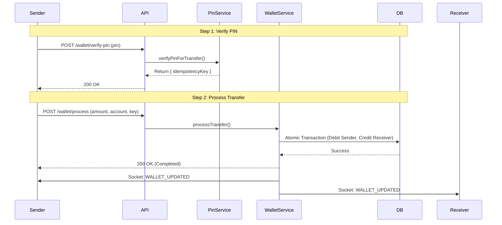
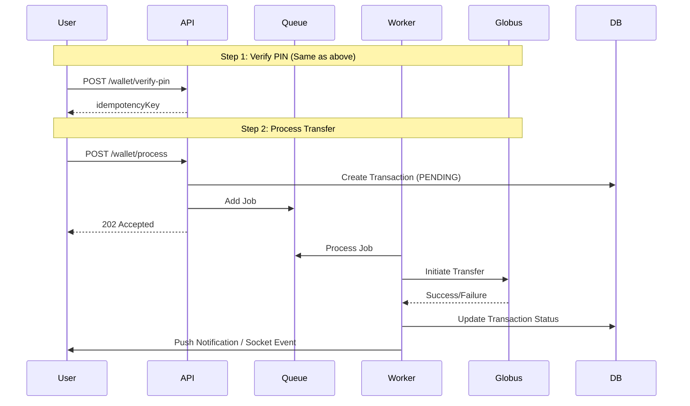

# Wallet & Core Banking Module

## Overview

The Wallet & Core Banking Module is the financial heart of SwapLink. It manages user wallets (NGN), handles money movement (Internal & External transfers), integrates with banking providers (Globus Bank), and ensures financial integrity through atomic transactions and reconciliation.

## Architecture

### System Components

-   **WalletService**: Core logic for balance management, transfers, and atomic ledger entries.
-   **PinService**: Manages transaction PINs (Set, Update, Verify) and issues idempotency keys.
-   **BeneficiaryService**: Manages saved recipients for quick transfers.
-   **GlobusService**: Integration layer for Globus Bank API (Account creation, Transfers, Requery).
-   **TransferWorker**: Background worker for processing asynchronous external transfers.
-   **ReconciliationJob**: Cron jobs for detecting and resolving stuck transactions and daily discrepancies.
-   **WebhookService**: Handles inbound notifications from banking providers (e.g., Deposits).

### Data Models

-   **Wallet**: Stores user balance (Decimal precision). 1:1 with User.
-   **VirtualAccount**: Dedicated NUBAN for receiving funds. Linked to Wallet.
-   **Transaction**: Immutable record of all money movement. Types: `DEPOSIT`, `TRANSFER`, `WITHDRAWAL`, `FEE`, `REVERSAL`.
-   **Beneficiary**: Saved recipients for quick transfers.

---

## Workflows

### 1. Transfer Flow (Internal & External)

Transfers follow a secure **2-step process**:

1.  **Verify PIN**: User enters PIN. Server verifies and returns a time-limited `idempotencyKey`.
2.  **Process Transfer**: Client sends transfer details with the `idempotencyKey`.

#### Internal Transfer (P2P)

Internal transfers are **synchronous** and **atomic**.



#### External Transfer (Outbound)

External transfers are **asynchronous**.



---

## API Reference & Postman Testing

### Prerequisites

-   **Base URL**: `http://localhost:3000/api/v1`
-   **Auth**: Bearer Token required.

### 1. Get Wallet Balance

Retrieve current balance and virtual account details.

-   **Method**: `GET`
-   **URL**: `{{baseUrl}}/wallet`
-   **Response**:
    ```json
    {
        "balance": 50000.0,
        "currency": "NGN",
        "virtualAccount": {
            "accountNumber": "1100000000",
            "bankName": "Globus Bank"
        }
    }
    ```

### 2. Get Transactions

Retrieve transaction history with pagination and filtering.

-   **Method**: `GET`
-   **URL**: `{{baseUrl}}/wallet/transactions?page=1&limit=20&type=DEPOSIT`
-   **Response**:
    ```json
    {
        "transactions": [
            {
                "id": "uuid...",
                "amount": 5000,
                "type": "DEPOSIT",
                "status": "SUCCESS",
                "createdAt": "2023-10-27T10:00:00Z"
            }
        ],
        "meta": { "total": 100, "page": 1, "limit": 20 }
    }
    ```

### 3. Get Beneficiaries

Retrieve saved beneficiaries.

-   **Method**: `GET`
-   **URL**: `{{baseUrl}}/wallet/beneficiaries`

### 4. Name Enquiry

Resolve an account number before transfer.

-   **Method**: `GET`
-   **URL**: `{{baseUrl}}/wallet/name-enquiry?accountNumber=1234567890&bankCode=000`
-   **Response**:
    ```json
    {
        "accountName": "JOHN DOE",
        "accountNumber": "1234567890",
        "bankCode": "000",
        "isInternal": false
    }
    ```

### 5. PIN Management

#### Set or Update PIN

-   **Method**: `POST`
-   **URL**: `{{baseUrl}}/wallet/pin`
-   **Body (Set)**: `{ "newPin": "1234" }`
-   **Body (Update)**: `{ "oldPin": "1234", "newPin": "5678" }`

#### Verify PIN (Step 1 of Transfer)

-   **Method**: `POST`
-   **URL**: `{{baseUrl}}/wallet/verify-pin`
-   **Body**: `{ "pin": "1234" }`
-   **Response**: `{ "idempotencyKey": "uuid..." }`

### 6. Process Transfer (Step 2)

Send money to an internal or external account. Requires `idempotencyKey` from PIN verification.

-   **Method**: `POST`
-   **URL**: `{{baseUrl}}/wallet/process`
-   **Headers**: `idempotency-key: <uuid>` (Optional, can be in body)
-   **Body**:
    ```json
    {
        "amount": 5000,
        "accountNumber": "1234567890",
        "bankCode": "000",
        "narration": "Payment for services",
        "idempotencyKey": "uuid..." // If not in header
    }
    ```

### 7. Webhook (Globus Bank)

Simulate an inbound deposit from Globus Bank. This endpoint handles credit notifications.

-   **Method**: `POST`
-   **URL**: `{{baseUrl}}/webhooks/globus`
-   **Headers**: `x-globus-signature: <hmac_sha256_signature>` (Calculated using `GLOBUS_WEBHOOK_SECRET` and raw request body)
-   **Body**:
    ```json
    {
        "type": "credit_notification",
        "data": {
            "accountNumber": "1100000000", // User's Virtual Account
            "amount": 10000,
            "reference": "REF-12345",
            "sessionId": "SESSION-987654321", // Optional
            "originatorName": "Sender Name",
            "originatorAccount": "0000000000",
            "originatorBank": "Access Bank"
        }
    }
    ```

#### Processing Logic

1.  **Signature Verification**: Validates `x-globus-signature` against the raw body using HMAC-SHA256.
2.  **Idempotency Check**: Checks if a transaction with the same `reference` already exists. If so, ignores the request.
3.  **Wallet Lookup**: Finds the user wallet associated with the `accountNumber`.
4.  **Fee Deduction**: Automatically deducts an inbound fee (e.g., ₦53.50) if the amount covers it.
5.  **Atomic Credit**: Credits the user's wallet and records the transaction atomically.
6.  **Notification**: Sends a push notification to the user.

---

## Mobile App Integration (Expo)

### 1. Real-time Balance Updates

The wallet balance changes frequently. Instead of polling, listen for the `WALLET_UPDATED` socket event.

```typescript
// Socket Listener
socket.on('WALLET_UPDATED', data => {
    console.log('New Balance:', data.balance);
    // Update Redux/Zustand store
    updateWalletStore(data);

    // Show Toast
    if (data.message) {
        Toast.show(data.message);
    }
});
```

### 2. Transaction History

Fetch transactions with pagination.

-   **Endpoint**: `GET /api/v1/wallet/transactions?page=1&limit=20`
-   **Display**: Group by date (Today, Yesterday, etc.). Show `type` (Credit/Debit) and `status` (Pending/Success/Failed).

### 3. PIN Management

Transactions require a 4-digit PIN.

-   **Setup/Update**: `POST /api/v1/wallet/pin`
-   **Verify**: Call `POST /api/v1/wallet/verify-pin` to get `idempotencyKey` before calling `process`.

### 4. Handling Deep Links

-   **Inbound**: When a user receives money, the push notification should deep link to the **Transaction Details** screen.
    -   Scheme: `swaplink://transaction/:id`

---

## Testing Guide

1.  **Unit Tests**: Run `npm run test:unit` to verify `WalletService` logic (fees, atomic transactions).
2.  **Integration Tests**: Run `npm run test:integration` to test API endpoints with a test database.
3.  **Manual Testing**:
    -   Use **Postman** to create a user and generate a virtual account.
    -   Use the **Webhook Simulation** endpoint to fund the wallet.
    -   Perform an **Internal Transfer** between two test users.
    -   Perform an **External Transfer** (mocked) and verify the `TransferWorker` processes it.
